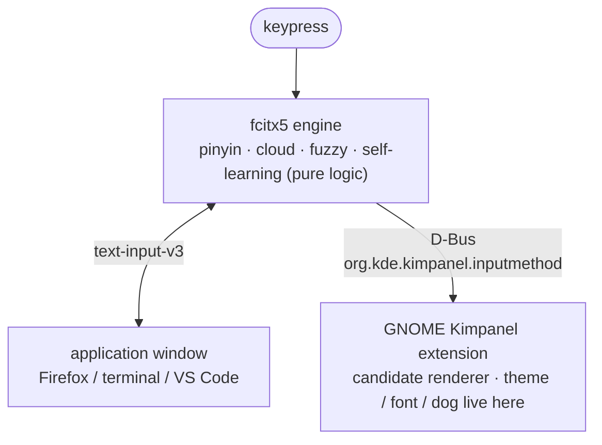

# Replacing Sogou with fcitx5 on Ubuntu: cloud pinyin, fuzzy pinyin, and a running dog

[](LICENSE)    [](https://github.com/jajupmochi/ubuntu-fcitx5-pinyin/stargazers)

Author: jajupmochi (human) × Claude Code (Opus 4.7)
语言 / Language: [中文](README.md) · **English**

> Note: this setup was done by the article's human author (working at the University of Bern at the time) together with Claude (Claude Code, model Opus 4.7). To keep clear who did what, below **"the author" means the human** (decides requirements, taste, judgment calls) and **"Claude" means the AI** (does the hands-on config, code, drawing).

Sogou stopped typing under Wayland, the author didn't want to fall back to Xorg, so the whole thing moved to fcitx5 — and picked up a few custom touches along the way. Commands are copy-paste ready.

> This is the author's personal config plus one small hack, shared as-is. `panel.js` / `stylesheet.css` are modified from the [kimpanel extension](https://github.com/wengxt/gnome-shell-extension-kimpanel) (GPL-2.0) and may need tweaks after major GNOME / fcitx5 updates. License and credits at the end.

---

## A prompt for your AI agent

Don't want to type it all? Hand this to Claude Code or any command-capable agent:

```text
You are my Linux desktop config assistant. Environment: Ubuntu 24.04 + GNOME +
Wayland. Reproduce the whole fcitx5 setup from this tutorial (cloud pinyin,
fuzzy pinyin, self-learning, Kimpanel panel, theme, font, a dog that runs while
the cloud loads).

First, get the full tutorial:
- If you can fetch web pages, read this article's URL directly:
  <put this article's URL here> and pull in the whole body;
- If you can't (e.g. Zhihu anti-bot returns 403), have me paste the article
  from the next section to the end.

Then:
1. Probe the environment first: whoami, echo $XDG_SESSION_TYPE,
   gnome-shell --version, dpkg -l | grep fcitx — tell me the results;
2. Follow the sections in order; substitute the real username/paths on my box;
3. Before editing ANY file under ~/.config/fcitx5, run pkill -x fcitx5 first,
   then edit, then relaunch in the background — else fcitx5 overwrites your
   edits with its stale config on exit;
4. After editing GNOME extension JS (panel.js), remind me a logout/login is
   required — disable/enable won't do;
5. Stop after each section and let me confirm.
```

---

## Table of contents

- [1. Why switch to fcitx5](#1-why-switch-to-fcitx5)
- [2. The result](#2-the-result)
- [3. Two layers](#3-two-layers)
- [4. Install fcitx5 and Chinese support](#4-install-fcitx5-and-chinese-support)
- [5. Tuning the pinyin engine](#5-tuning-the-pinyin-engine)
  - [5.1 Config gets rewritten (read first)](#51-config-gets-rewritten-read-first)
  - [5.2 Show the pinyin preedit](#52-show-the-pinyin-preedit)
  - [5.3 Cloud pinyin (Baidu)](#53-cloud-pinyin-baidu)
  - [5.4 Fuzzy pinyin](#54-fuzzy-pinyin)
  - [5.5 Self-learning](#55-self-learning)
  - [5.6 Keys](#56-keys)
- [6. Killing the flicker: the Kimpanel extension](#6-killing-the-flicker-the-kimpanel-extension)
- [7. The custom parts](#7-the-custom-parts)
  - [7.1 Color: University of Bern red](#71-color-university-of-bern-red)
  - [7.2 Font: LXGW WenKai](#72-font-lxgw-wenkai)
  - [7.3 Cloud-loading animation: a running dog](#73-cloud-loading-animation-a-running-dog)
  - [7.4 Lua extras](#74-lua-extras)
- [8. Make it yours: every configurable knob](#8-make-it-yours-every-configurable-knob)
- [9. Troubleshooting](#9-troubleshooting)
- [10. Downloads](#10-downloads)

---

## 1. Why switch to fcitx5

The author had used Sogou for years. One day the tray icon was still there but not a single character would type. Reinstalling and wiping configs didn't help — the problem wasn't Sogou, it was the recent switch from Xorg to Wayland.

Falling back to Xorg revived Sogou, but the author found the whole desktop noticeably sluggish, across the board. A few daily, obvious cases (personal feel — Wayland is smoother in all of them):

- File manager opening a directory of thousands of files: Xorg stutters on thumbnails and tears on scroll; Wayland is smooth.
- Browser cold start, dragging tabs, switching workspaces: Wayland is faster and steadier, Xorg drops the odd frame.
- VS Code (Electron) scrolling big files and repainting split panes: smearing on Xorg, in-step on Wayland.
- Multi-monitor mixed-DPI scaling: Xorg's fractional scaling is blurry and windows flicker across screens; Wayland gives each display its own DPI, smooth. Almost decisive for the author.

So the author stayed on Wayland and dropped Sogou. Not ibus (weaker pinyin), but fcitx5: rich plugins, good `text-input-v3` support on Wayland. See [Arch Wiki: Fcitx5](https://wiki.archlinux.org/title/Fcitx5).

Plan: **the fcitx5 engine + its built-in pinyin + the GNOME Kimpanel extension to draw the candidate panel.** Why the panel is pulled out: section 6.

## 2. The result

Normally: a warm off-white card, a Bern-red highlight pill, a live pinyin preedit on top.


The instant Baidu cloud pinyin fires, the 2nd slot pops up a little running tan Chinese rural dog the author named Mimi — tan coat, red collar, a tiny 咪 tag:


The animation alone (8 frames, 75ms each, a 600ms loop):


## 3. Two layers

Configuring fcitx5 trips people on one misconception: treating the input method as one thing. On GNOME Wayland it's two layers, and separating them gives every later step a home.



- **Engine layer, fcitx5**: decides *what gets typed*. Config under `~/.config/fcitx5/`.
- **Render layer, Kimpanel extension**: decides *how it looks*. Files under `~/.local/share/gnome-shell/extensions/kimpanel@kde.org/`.

Not fcitx5's built-in classicui renderer, because it flickers on GNOME Wayland (section 6).

> Environment: Ubuntu 24.04 / GNOME 46 / Wayland, fcitx5 5.1.7.

## 4. Install fcitx5 and Chinese support

The three essentials:

```bash
sudo apt update
sudo apt install -y fcitx5 fcitx5-chinese-addons fcitx5-config-qt
```

`fcitx5-chinese-addons` is the key one — pinyin engine, cloud pinyin, shuangpin, character decomposition. Add `fcitx5-rime fcitx5-table-extra` if you want RIME or code tables (optional; this post uses the built-in pinyin).

Environment variables, into `~/.config/environment.d/` (GNOME reads it on Wayland via the systemd user environment):

```bash
mkdir -p ~/.config/environment.d
cat > ~/.config/environment.d/fcitx.conf <<'EOF'
GTK_IM_MODULE=fcitx
QT_IM_MODULE=fcitx
XMODIFIERS=@im=fcitx
EOF
im-config -n fcitx5
```

Note: native Wayland apps on GNOME use `text-input-v3` and work even without `GTK_IM_MODULE`; the three vars mainly backstop XWayland, Qt, and Electron apps. Without them, some apps can't type Chinese.

Enable autostart, then **log out and back in**:

```bash
cp /usr/share/applications/org.fcitx.Fcitx5.desktop ~/.config/autostart/ 2>/dev/null || true
```

Verify:

```bash
pgrep -a fcitx5
echo "$GTK_IM_MODULE / $QT_IM_MODULE / $XMODIFIERS"   # expect fcitx / fcitx / @im=fcitx
```

`Ctrl+Space` to switch to pinyin; if Chinese types, done. It looks plain and may flicker — continue.

## 5. Tuning the pinyin engine

All of this edits text under `~/.config/fcitx5/conf/`. Full files in [`resources/fcitx5/`](resources/fcitx5/), copyable (read 5.1 first).

### 5.1 Config gets rewritten (read first)

On exit, fcitx5 rewrites `conf/*.conf` entirely from its in-memory config. So **editing a file while it runs gets overwritten on next restart**. The author lost almost an hour here.

Right order:

```bash
pkill -x fcitx5; sleep 1.5
# edit / overwrite files
setsid fcitx5 -d </dev/null &>/dev/null &
```

Every hand-edit below assumes this frame. Editing via the `fcitx5-configtool` GUI is exempt.

### 5.2 Show the pinyin preedit

Show the full typed pinyin atop the panel, Sogou-style. `~/.config/fcitx5/conf/pinyin.conf`:

```ini
PinyinInPreedit=True
PreeditMode="Composing pinyin"
PageSize=7
```

In `~/.config/fcitx5/config`, turn off embedding the preedit into the app so it shows uniformly in the floating panel:

```ini
[Behavior]
PreeditEnabledByDefault=False
```

### 5.3 Cloud pinyin (Baidu)

For rare words/names/neologisms the local dictionary can't produce. `pinyin.conf`:

```ini
CloudPinyinEnabled=True
CloudPinyinIndex=2          # cloud candidate into slot 2
CloudPinyinAnimation=True   # loading placeholder (Mimi's entry point)
```

Backend in `cloudpinyin.conf`, just two lines:

```ini
MinimumPinyinLength=4
Backend=Baidu               # Baidu | Google | GoogleCN
```

Note: fcitx5 has no Sogou backend; Baidu is most reliable on a mainland network. `CloudPinyinIndex=2` is why Mimi sits at slot 2 — see the second screenshot.

### 5.4 Fuzzy pinyin

Lets `in` match `ing`, `s` match `sh`, etc. The `[Fuzzy]` block in `pinyin.conf`, the author's set (copy as-is):

```ini
[Fuzzy]
VE_UE=True
NG_GN=True
Inner=True
InnerShort=True
PartialFinal=True
AN_ANG=True
EN_ENG=True
IN_ING=True
IAN_IANG=True
UAN_UANG=True
Z_ZH=True
C_CH=True
S_SH=True
L_N=True
F_H=True
V_U=False      # these two are noisy when on; off
U_OU=False
```

### 5.5 Self-learning

No config needed; fcitx5 pinyin self-learns by default into:

```
~/.local/share/fcitx5/pinyin/user.dict
~/.local/share/fcitx5/pinyin/user.history
```

The more you type, the better the ordering. Delete those files to wipe memory. Turn on prediction too:

```ini
Prediction=True
PredictionSize=10
```

Note: fcitx5 can't confirm a *predicted* word with space (space always confirms the current highlight); pick predicted words with number keys. Engine design, no switch.

### 5.6 Keys

The author's habit: arrows ← → move the cursor in the preedit; `Tab` / `Shift+Tab` page candidates, number keys lock one in. `~/.config/fcitx5/config`:

```ini
[Hotkey/PrevCandidate]
0=Shift+Tab

[Hotkey/NextCandidate]
0=Tab
```

Don't bind `Left`/`Right` to candidate selection — leave them free so the arrows return to cursor movement.

## 6. Killing the flicker: the Kimpanel extension

The candidate window flickers now and then, especially on the cloud spinner. Root cause: fcitx5's built-in classicui draws its floating window with an `xdg_popup` on GNOME Wayland, and the compositor isn't friendly to such input-method popups — each refresh may rebuild the window.

The fix isn't to patch classicui but to bypass it: let GNOME draw the panel via the Kimpanel extension. fcitx5 tells it the candidates over D-Bus; it draws with GNOME's native St toolkit, no extra system window, flicker gone. Bonus: theme, font, even a dog become controllable.

Install "Input Method Panel (Kimpanel)" from the store (<https://extensions.gnome.org/extension/261/kimpanel/>, UUID `kimpanel@kde.org`), then **log out and back in**. The edited files are in [`resources/kimpanel/`](resources/kimpanel/).

Enable:

```bash
gsettings set org.gnome.shell disable-user-extensions false
gnome-extensions enable kimpanel@kde.org
gnome-extensions info kimpanel@kde.org | grep State   # expect ACTIVE
```

Note: the author got stuck here — if `disable-user-extensions` is `true` it silently disables all user extensions and the state stays `INITIALIZED`. Set it back to `false` first.

## 7. The custom parts

These are what the author and Claude built. All of it edits `stylesheet.css` (look) and `panel.js` (behavior) in the Kimpanel directory.

### 7.1 Color: University of Bern red

The author was at the University of Bern, so the accent is the Bern brand red. Official palette: [CTU-Bern/unibeCols](https://github.com/CTU-Bern/unibeCols), `unibeRed` = `#E4003C`.

The assignment (`stylesheet.css`, copy as-is):

```css
.popup-menu-content.kimpanel-popup-content {
  background-color: #f6f2ec;     /* warm off-white card */
  border: 1px solid #e4ded6;
  border-radius: 12px;
  padding: 1px 2px;              /* white border around the highlight; smaller = tighter */
  color: #33312e;
}
.kimpanel-candidate-item {
  border-radius: 8px;
  padding: 0.1em 0.46em;
  margin: 0;
  transition-duration: 0ms;
}
.kimpanel-candidate-item:hover { background-color: rgba(215, 38, 61, 0.12); }
.kimpanel-popup-content .kimpanel-candidate-item:active {
  background-color: #d7263d;     /* current candidate: Bern-red pill */
  color: #ffffff;
}
```

Note: the strict official `#E4003C` is highly saturated and tiring as a full block. So the pill uses a softened `#d7263d`, with the official red kept in the classicui fallback theme — an eye-comfort vs brand compromise.

### 7.2 Font: LXGW WenKai

The author wanted a handwritten feel, so the open-source LXGW WenKai. Install:

```bash
mkdir -p ~/.local/share/fonts
# download LXGWWenKai-Regular.ttf from https://github.com/lxgw/LxgwWenKai/releases
mv ~/Downloads/LXGWWenKai-Regular.ttf ~/.local/share/fonts/
fc-cache -f
fc-list | grep -i wenkai
```

Note: the Kimpanel font can't be set via CSS — St ignores `!important`, and the extension uses an inline style read from a gsetting that beats CSS. So use the gsetting, which **applies live, no relogin**:

```bash
gsettings --schemadir ~/.local/share/gnome-shell/extensions/kimpanel@kde.org/schemas \
  set org.gnome.shell.extensions.kimpanel font 'LXGW WenKai 14'
```

Format `'family size'`; change the number for size, or `'Sans 14'` for the default.

Claude couldn't get the size right until it traced a hardcoded `; font-size: 16pt;` appended in `panel.js`'s `updateFont()`, overriding the gsetting. Drop it and let the gsetting decide:

```javascript
updateFont(textStyle) {
    this.text_style = textStyle;          // no hardcoded size here
    this.auxText.set_style(this.text_style);
    this.preeditText.set_style(this.text_style);
    let lookupTable = this.lookupTableLayout.get_children();
    for (let i = 0; i < lookupTable.length; i++) lookupTable[i].set_style(this.text_style);
}
```

Note: CSS applies live, but editing `panel.js` requires a logout/login — GNOME caches the extension's ESM module; `disable/enable` won't reload it.

### 7.3 Cloud-loading animation: a running dog

With `CloudPinyinAnimation=True`, while waiting on the cloud fcitx5 cycles four spinner characters `◐ ◓ ◑ ◒` in the candidate slot. That slot already means "fetching data from far away," so the author wanted a dog running off to fetch it.

**How the asset came to be (human sets direction, Claude draws).** The author's requirements were picky: continuous frames of the *same* dog, no two alternating icons (looks like two dogs fighting), no extra paw/cloud emoji (the whole thing reads like a cloud), a tan Chinese rural dog with a red collar and a 咪咪 tag. Three steps:

1. **Claude Code drafts**: a PIL/Pillow script assembling a side-view dog from ellipses, polygons, lines — 4 frames. It ran, but pointed face, fox ears, head detached from body. Early version:

   

2. **The author calibrates round by round, Claude edits the script**: round cheek, rounded ears, connected neck, a perspective-correct near-side collar arc, smaller tag, trimmed rump, smaller head — seven or eight revisions. That parameterized script is at [`resources/kimpanel/dog/draw_dog_handdrawn_reference.py`](resources/kimpanel/dog/draw_dog_handdrawn_reference.py).

3. **Claude Design finalizes**: 8 frames, 160×120, transparent, a proper gallop gait, with trailing dust. The version in use:

   

The whole design package (8 frames + notes + CSS + preview) is in [`resources/dog-design.zip`](resources/dog-design.zip).

**How it moves (Claude's part, with one trap).** The naive idea is "character mapping": map each of `◐◓◑◒` to an image. But fcitx5 has only 4 spinner characters at its own cadence — at most 4 frames, uncontrollable rate. The final is 8 frames at 75ms.

The right way decouples the animation from fcitx5's characters: once a spinner character is detected in the candidates (cloud loading), start a GLib 75ms timer that cycles `d0→d7` independently, and stop when it disappears. `panel.js` core (copy as-is):

```javascript
import GLib from 'gi://GLib';   // top of file

// in _init(): this._dogTimer = 0; this._dogFrame = 0; this._dogIndex = -1;

// in setLookupTable(), iterate candidates and detect the spinner slot:
const _spin = {'◐':1, '◓':1, '◑':1, '◒':1};
let dogIdx = -1;
for (let i = 0; i < lookupTable.length; i++) {
    let _t = table[i];
    if (_spin[_t]) {
        dogIdx = i;
        lookupTable[i].text = '';                       // clear text; _paintDog draws the sprite
    } else {
        lookupTable[i].remove_style_class_name('kimpanel-dog');
        for (let _k = 0; _k < 8; _k++)
            lookupTable[i].remove_style_class_name('kimpanel-dog-' + _k);
        lookupTable[i].text = label[i] + _t;
    }
}
this._setDog(dogIdx);

_setDog(idx) {
    this._dogIndex = idx;
    if (idx < 0) { this._stopDog(); return; }
    let item = this.lookupTableLayout.get_children()[idx];
    if (!item) { this._stopDog(); return; }
    item.text = '';
    item.add_style_class_name('kimpanel-dog');
    this._paintDog();
    if (!this._dogTimer) {
        this._dogTimer = GLib.timeout_add(GLib.PRIORITY_DEFAULT, 75, () => {
            this._dogFrame = (this._dogFrame + 1) % 8;
            this._paintDog();
            return GLib.SOURCE_CONTINUE;
        });
    }
}
_paintDog() {
    let item = this.lookupTableLayout.get_children()[this._dogIndex];
    if (!item) { this._stopDog(); return; }
    for (let k = 0; k < 8; k++) item.remove_style_class_name('kimpanel-dog-' + k);
    item.add_style_class_name('kimpanel-dog-' + this._dogFrame);
}
_stopDog() {
    if (this._dogTimer) { GLib.source_remove(this._dogTimer); this._dogTimer = 0; }
    this._dogIndex = -1;
}
```

Call `this._stopDog()` once in `destroy()` to avoid a leak. Full file: [`resources/kimpanel/panel.js`](resources/kimpanel/panel.js).

Put the 8 PNGs `d0.png`…`d7.png` into the extension's `dog/`, then `stylesheet.css`:

```css
.kimpanel-dog {
  width: 44px; height: 32px;
  background-repeat: no-repeat;
  background-size: contain;
  background-position: center;
}
.kimpanel-dog-0 { background-image: url("dog/d0.png"); }
/* …d1 through d7… */
.kimpanel-dog-7 { background-image: url("dog/d7.png"); }
```

After placing images and editing both files, **log out and back in**, type a long pinyin (e.g. `woshizhongguoren`) to trigger a cloud lookup, and Mimi runs.

### 7.4 Lua extras

The author added a calculator and weekday via fcitx5's Lua. `~/.local/share/fcitx5/lua/imeapi/extensions/custom.lua` (full file in [`resources/fcitx5/lua/custom.lua`](resources/fcitx5/lua/custom.lua)):

```lua
-- Chinese mode: js(1+2)*3 -> 9 ; xq -> the weekday
ime.register_command("js", "custom_calc",    "计算器", "none",  "type an expression")
ime.register_command("xq", "custom_weekday", "星期",   "alpha", "today's weekday")
```

Usage: in Chinese mode press `;`, then type `js(1+2)*3` or `xq`. Quickphrases (email, kaomoji) go in `~/.local/share/fcitx5/data/quickphrase.d/custom.mb`, format `abbrev<Tab>expansion`. Kill-then-relaunch fcitx5 as usual.

## 8. Make it yours: every configurable knob

The value here is swapping in your own. First, everything you can change; then how. Each row notes the file and whether a relogin is needed. Written so an AI agent can follow it.

| What to change | Where | Live? |
|---|---|---|
| Card background | `stylesheet.css` `.kimpanel-popup-content` `background-color` | yes (CSS) |
| Highlight pill / brand color | `stylesheet.css` `:active` `background-color` + `:hover` `rgba(...)` | yes |
| Corners / white border | `stylesheet.css` `border-radius` / `padding` | yes |
| Font + size | gsetting `org.gnome.shell.extensions.kimpanel font` | yes |
| Candidate count | `pinyin.conf` `PageSize` | no (restart fcitx5) |
| Fuzzy set | `pinyin.conf` `[Fuzzy]` booleans | no |
| Cloud backend / trigger length | `cloudpinyin.conf` `Backend` / `MinimumPinyinLength` | no |
| Cloud candidate slot | `pinyin.conf` `CloudPinyinIndex` | no |
| Select / paging keys | `config` `[Hotkey/*Candidate]` `[*Page]` | no |
| Dog (look / frames / size / speed) | `dog/d*.png` + `stylesheet.css` `.kimpanel-dog*` + `panel.js` `% N` and 75ms | images/CSS live; `panel.js` needs relogin |
| Lua tools / quickphrases | `lua/.../custom.lua` / `quickphrase.d/custom.mb` | no |

**A checklist for an AI agent:**

1. **Swap the brand color (easiest, live)**: get your school/company main hex (their Corporate Design page, or [brandcolors.net](https://brandcolors.net/)), then in `stylesheet.css` globally replace `#d7263d` and `rgba(215,38,61,0.12)` with your value (the latter is the main color at 12% alpha). Optionally swap the background `#f6f2ec` too. Saves and applies live.

2. **Swap font/size (live)**: after installing the font, run that `gsettings ... font 'your-family size'`. Make sure `panel.js`'s `updateFont()` has no hardcoded `font-size` (see 7.2), or the gsetting is overridden.

3. **Swap Mimi (or another animal)**:
   - Draw with code: follow [`draw_dog_handdrawn_reference.py`](resources/kimpanel/dog/draw_dog_handdrawn_reference.py) — break the animal into ellipses/lines/polygons in PIL, nudge leg/tail coordinates per frame, supersample at `SS=6` and shrink with `LANCZOS`.
   - Generate with AI: prompt a text-to-image model — "draw a side-view running X, flat cartoon style, a standard 8-frame gallop cycle, each frame 160×120, transparent PNG, all facing left, smooth leg transitions between adjacent frames, named d0.png to d7.png".
   - With N frames: drop them in `dog/`, keep N `.kimpanel-dog-i` classes, change both `% 8` in `panel.js` to `% N`. It needn't be 8 — 3 works. Relogin after.

4. **Tune fuzzy / cloud / keys**: edit the matching `conf` per section 5, with the kill-then-relaunch step (5.1).

## 9. Troubleshooting

| Symptom | Cause | Fix |
|---|---|---|
| Config reverts after restart | fcitx5 rewrites config on exit | `pkill -x fcitx5` before editing (5.1) |
| Some apps can't type Chinese | env vars incomplete | three vars in `environment.d/fcitx.conf` + relogin (4) |
| Candidate window flickers | classicui's xdg_popup | switch to Kimpanel (6) |
| Kimpanel stuck at INITIALIZED | `disable-user-extensions=true` | set it back to `false` (6) |
| Font size won't change | `panel.js` hardcodes 16pt | delete it, leave it to the gsetting (7.2) |
| Font change has no effect | St ignores CSS fonts | use the gsetting, not CSS (7.2) |
| panel.js / dog change no effect | GNOME caches extension JS | log out and back in; `disable/enable` won't do |
| Want Sogou cloud | fcitx5 has no Sogou backend | use Baidu (5.3) |

## 10. Downloads

Bundled under `resources/`:

```
resources/
├── dog-design.zip               Mimi's final 8-frame design package
├── kimpanel/
│   ├── stylesheet.css           panel theme (final)
│   ├── panel.js                 panel behavior (incl. the timer-driven dog, final)
│   └── dog/ d0–d7.png + draw_dog_handdrawn_reference.py
└── fcitx5/
    ├── config  profile
    ├── conf/ pinyin.conf  cloudpinyin.conf  classicui.conf
    ├── lua/custom.lua
    └── quickphrase/custom.mb
```

External:

- LXGW WenKai: <https://github.com/lxgw/LxgwWenKai/releases> (OFL)
- Kimpanel extension: <https://extensions.gnome.org/extension/261/kimpanel/>
- University of Bern palette: <https://github.com/CTU-Bern/unibeCols> (`unibeRed` = `#E4003C`)
- fcitx5 docs: <https://wiki.archlinux.org/title/Fcitx5>

The font file (25MB) isn't bundled due to size; grab it from the link above.

Mimi isn't useful at all — just the author's small delight; catching it scamper off while the cloud fetches is oddly relaxing. Swap in your own animal (section 8).

---

## License & credits

- `resources/kimpanel/panel.js` and `resources/kimpanel/stylesheet.css` are modified from the [kimpanel GNOME extension](https://github.com/wengxt/gnome-shell-extension-kimpanel) (© Xuetian Weng and contributors, GPL-2.0); because this repo includes them, it is distributed as a whole under **GPL-2.0** (see [`LICENSE`](LICENSE)).
- Mimi's art and design package (`resources/kimpanel/dog/*.png`, `resources/dog-design.zip`) and this tutorial text are additionally offered by the author under **CC-BY-4.0** (attribution: Linlin Jia).
- The config snippets under `resources/fcitx5/` are free to reuse (CC0).
- The LXGW WenKai font is not bundled; see the link above (SIL OFL).
- Credits: kimpanel, fcitx5, LXGW WenKai, the University of Bern palette. Mimi was drawn by Claude Code (code draft) and Claude (final polish).
