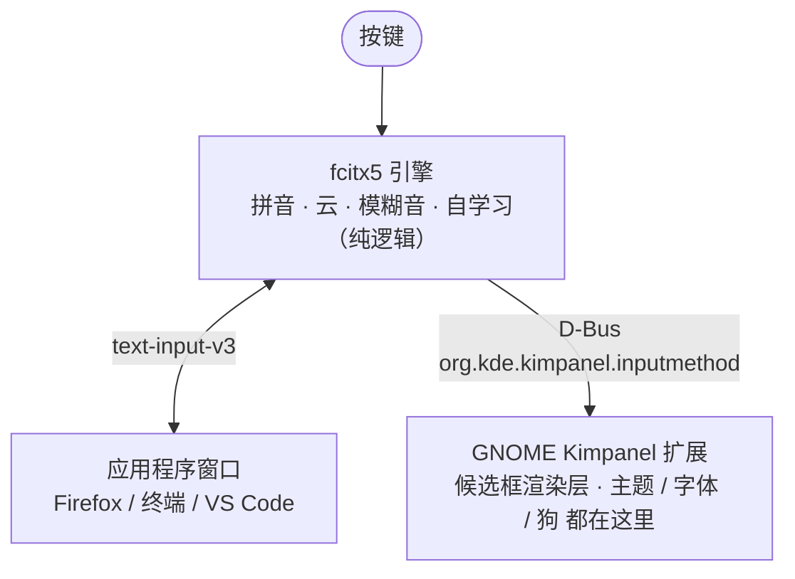

# Ubuntu 上把搜狗换成 fcitx5：云拼音、模糊音，外加一只跑动的狗

[](LICENSE)    [](https://github.com/jajupmochi/ubuntu-fcitx5-pinyin/stargazers)

作者：贾林林（人类） × Claude Code（Opus 4.7）
语言 / Language：**中文** · [English](README.en.md)

> 说明：这套配置是本文的人类作者（这时在伯尔尼大学工作）和 Claude（Claude Code，模型 Opus 4.7）一起做的。下文为了分清谁干了什么，**「作者」指人类**（拍板需求、定审美、踩坑判断），**「Claude」指 AI**（动手配置、写代码、画图）。

搜狗在 Wayland 下打不出字了，作者不想退回 Xorg，于是整套换成 fcitx5，过程中顺手做了点自己的东西。命令都能直接复制。

> 这是作者的个人配置加一个小 hack，按现状（as-is）分享。`panel.js` / `stylesheet.css` 改自 [kimpanel 扩展](https://github.com/wengxt/gnome-shell-extension-kimpanel)（GPL-2.0），GNOME / fcitx5 大版本更新后可能要微调。许可与致谢见文末。

---

## 给 AI Agent 的一段话

不想手敲的话，把下面这段交给 Claude Code 或任意能跑命令的 agent：

```text
你是我的 Linux 桌面配置助手，环境 Ubuntu 24.04 + GNOME + Wayland。
请按这篇教程复刻整套 fcitx5 配置（云拼音、模糊音、自学习、Kimpanel
面板、主题、字体、云加载时跑动的狗）。

先拿到教程全文：
- 你若能抓网页，直接读取这篇文章的地址 <这里填本文 URL>，把正文读进来；
- 抓不到（例如知乎反爬返回 403），就让我把本文从下一节起到结尾复制给你。

然后：
1. 先探测环境：whoami、echo $XDG_SESSION_TYPE、gnome-shell --version、
   dpkg -l | grep fcitx，结果讲给我听；
2. 按章节顺序执行，命令里的用户名/路径换成我机器上的真实值；
3. 改 ~/.config/fcitx5 下任何文件前先 pkill -x fcitx5，改完再后台拉起，
   否则 fcitx5 退出时会用旧配置把改动覆盖掉；
4. 改 GNOME 扩展 JS（panel.js）后提醒我：必须注销重登才生效，
   disable/enable 没用；
5. 每做完一节停下来让我确认。
```

---

## 目录

- [一、为什么换 fcitx5](#一为什么换-fcitx5)
- [二、最终效果](#二最终效果)
- [三、两层架构](#三两层架构)
- [四、装 fcitx5 和中文支持](#四装-fcitx5-和中文支持)
- [五、调拼音引擎](#五调拼音引擎)
  - [5.1 配置会被回写（先读）](#51-配置会被回写先读)
  - [5.2 显示拼音预编辑](#52-显示拼音预编辑)
  - [5.3 云拼音（百度）](#53-云拼音百度)
  - [5.4 模糊音](#54-模糊音)
  - [5.5 自学习](#55-自学习)
  - [5.6 键位](#56-键位)
- [六、消除候选框闪烁：Kimpanel 扩展](#六消除候选框闪烁kimpanel-扩展)
- [七、自定义部分](#七自定义部分)
  - [7.1 配色：伯尔尼大学红](#71-配色伯尔尼大学红)
  - [7.2 字体：霞鹜文楷](#72-字体霞鹜文楷)
  - [7.3 云加载动画：跑动的咪咪](#73-云加载动画跑动的咪咪)
  - [7.4 Lua 小工具](#74-lua-小工具)
- [八、自己改：所有可配置项](#八自己改所有可配置项)
- [九、踩坑速查](#九踩坑速查)
- [十、资源下载](#十资源下载)

---

## 一、为什么换 fcitx5

作者一直用搜狗。某天开机后状态栏图标还在，但一个字打不出来。重装、清配置都没用——问题不在搜狗，在于刚把桌面从 Xorg 换成了 Wayland。

退回 Xorg 能让搜狗复活，但作者用下来觉得整个桌面明显变迟钝。几个每天都遇到、对比明显的地方（纯个人体感，Wayland 都更顺）：

- 文件管理器开几千文件的大目录：Xorg 下缩略图刷新卡顿、滚动撕裂；Wayland 丝滑。
- 浏览器冷启动、拖标签、切工作区：Wayland 更快更稳，Xorg 偶尔掉帧。
- VS Code 这类 Electron 应用滚大文件、分屏重绘：Xorg 有拖影，Wayland 跟手。
- 多屏混合 DPI 缩放：Xorg 分数缩放糊、跨屏拖窗口闪；Wayland 每屏独立 DPI、平滑。这条对作者几乎是决定性的。

所以作者的选择是留在 Wayland、放弃搜狗。不用 ibus（拼音体验差一截），改用 fcitx5：插件齐全、对 Wayland 的 `text-input-v3` 支持好。参考 [Arch Wiki: Fcitx5](https://wiki.archlinux.org/title/Fcitx5)。

方案：**fcitx5 引擎 + 自带拼音 + GNOME 的 Kimpanel 扩展画候选框**。为什么候选框要单独拎出来，见第六节。

## 二、最终效果

平时：暖米白卡片、伯尔尼红药丸高亮、顶部一行实时拼音预编辑。


触发百度云拼音那一瞬间，第 2 候选位会蹦出一只跑动的中华田园犬——作者给它起名叫咪咪，棕黄毛、红项圈、挂着写「咪」字的小牌子：


单独看动画（8 帧、75ms 一帧、600ms 一循环）：


## 三、两层架构

配 fcitx5 容易卡在一个误解上：以为输入法是一个整体。在 GNOME Wayland 上它是两层，分清楚后每步操作都有归属。



- **引擎层 fcitx5**：决定「打什么」。配置在 `~/.config/fcitx5/`。
- **渲染层 Kimpanel 扩展**：决定「显示成什么样」。文件在 `~/.local/share/gnome-shell/extensions/kimpanel@kde.org/`。

不用 fcitx5 自带的 classicui 渲染，因为它在 GNOME Wayland 下会闪（见第六节）。

> 环境：Ubuntu 24.04 / GNOME 46 / Wayland，fcitx5 5.1.7。

## 四、装 fcitx5 和中文支持

核心三件套：

```bash
sudo apt update
sudo apt install -y fcitx5 fcitx5-chinese-addons fcitx5-config-qt
```

`fcitx5-chinese-addons` 最关键，拼音引擎、云拼音、双拼、拆字都在里面。需要 RIME 或码表再加 `fcitx5-rime fcitx5-table-extra`（可选，本文用自带拼音）。

环境变量，写到 `~/.config/environment.d/`（GNOME 在 Wayland 通过 systemd 用户环境读它）：

```bash
mkdir -p ~/.config/environment.d
cat > ~/.config/environment.d/fcitx.conf <<'EOF'
GTK_IM_MODULE=fcitx
QT_IM_MODULE=fcitx
XMODIFIERS=@im=fcitx
EOF
im-config -n fcitx5
```

注意：GNOME 原生 Wayland 应用走 `text-input-v3`，不设 `GTK_IM_MODULE` 也能用 fcitx5；上面三个变量主要给 XWayland、Qt、Electron 应用兜底。不设的话部分软件打不了中文。

设开机自启，然后**注销重登**：

```bash
cp /usr/share/applications/org.fcitx.Fcitx5.desktop ~/.config/autostart/ 2>/dev/null || true
```

验证：

```bash
pgrep -a fcitx5
echo "$GTK_IM_MODULE / $QT_IM_MODULE / $XMODIFIERS"   # 期望 fcitx / fcitx / @im=fcitx
```

`Ctrl+Space` 切到拼音能打字即可。此时样子素、可能闪，继续。

## 五、调拼音引擎

以下都在 `~/.config/fcitx5/conf/` 改文本。完整文件在 [`resources/fcitx5/`](resources/fcitx5/)，可直接覆盖（先读 5.1）。

### 5.1 配置会被回写（先读）

fcitx5 退出时会用内存里的配置整个重写 `conf/*.conf`。所以**在它运行时手改文件，改动会在下次重启被覆盖**。作者在这上面卡了快一个小时。

正确顺序：

```bash
pkill -x fcitx5; sleep 1.5
# 改文件 / 覆盖文件
setsid fcitx5 -d </dev/null &>/dev/null &
```

下文每处手改都默认在这个框架里。用 `fcitx5-configtool` 图形界面改则不受此限。

### 5.2 显示拼音预编辑

像搜狗那样在候选框顶部显示已敲的完整拼音。`~/.config/fcitx5/conf/pinyin.conf`：

```ini
PinyinInPreedit=True
PreeditMode="Composing pinyin"
PageSize=7
```

`~/.config/fcitx5/config` 里关掉「把预编辑嵌进应用」，让预编辑统一显示在浮动候选框上：

```ini
[Behavior]
PreeditEnabledByDefault=False
```

### 5.3 云拼音（百度）

本地词库打不出的生僻词、人名、新词，从云端取。`pinyin.conf`：

```ini
CloudPinyinEnabled=True
CloudPinyinIndex=2          # 云候选插到第 2 位
CloudPinyinAnimation=True   # 云加载动画占位（后面咪咪的入口）
```

后端在 `cloudpinyin.conf`，整个就两行：

```ini
MinimumPinyinLength=4
Backend=Baidu               # 可选 Baidu | Google | GoogleCN
```

注意：fcitx5 没有搜狗后端，国内网络下百度最稳。`CloudPinyinIndex=2` 决定了狗固定出现在第 2 候选位——对照第二张效果图。

### 5.4 模糊音

让 `in` 匹配 `ing`、`s` 匹配 `sh` 等。`pinyin.conf` 的 `[Fuzzy]` 段，作者开的这组可直接抄：

```ini
[Fuzzy]
VE_UE=True
NG_GN=True
Inner=True
InnerShort=True
PartialFinal=True
AN_ANG=True
EN_ENG=True
IN_ING=True
IAN_IANG=True
UAN_UANG=True
Z_ZH=True
C_CH=True
S_SH=True
L_N=True
F_H=True
V_U=False      # 这两个开了噪声大，关
U_OU=False
```

### 5.5 自学习

不用配，fcitx5 拼音默认就自学习，记到：

```
~/.local/share/fcitx5/pinyin/user.dict
~/.local/share/fcitx5/pinyin/user.history
```

打得越多排序越懂你。想清空记忆就删这两个文件。联想也顺手开上：

```ini
Prediction=True
PredictionSize=10
```

注意：fcitx5 不支持空格键确认联想词（空格永远确认当前高亮），联想词只能数字键选。这是引擎设计，没有开关。

### 5.6 键位

作者的习惯：方向键 ← → 留给预编辑里移动光标，选词用 `Tab` / `Shift+Tab` 翻、数字键定。`~/.config/fcitx5/config`：

```ini
[Hotkey/PrevCandidate]
0=Shift+Tab

[Hotkey/NextCandidate]
0=Tab
```

不要把 `Left`/`Right` 绑到候选选择，留空它们方向键才回归光标移动。

## 六、消除候选框闪烁：Kimpanel 扩展

候选框时不时闪一下，尤其出现云加载转圈符时。根因是 fcitx5 自带的 classicui 在 GNOME Wayland 下用 `xdg_popup` 画浮动窗口，GNOME 合成器对这种输入法 popup 不友好，每次刷新可能重建窗口。

解法不是修 classicui，而是绕过它：让 GNOME 用 Kimpanel 扩展画候选框。fcitx5 通过 D-Bus 把候选告诉扩展，扩展用 GNOME 原生 St 工具画，不建额外系统窗口，闪烁消失。附带好处：主题、字体、塞只狗都变得可控。

从扩展商店装「Input Method Panel (Kimpanel)」（<https://extensions.gnome.org/extension/261/kimpanel/>，UUID `kimpanel@kde.org`），装完**注销重登**。改好的文件在 [`resources/kimpanel/`](resources/kimpanel/)。

启用：

```bash
gsettings set org.gnome.shell disable-user-extensions false
gnome-extensions enable kimpanel@kde.org
gnome-extensions info kimpanel@kde.org | grep State   # 期望 ACTIVE
```

注意：作者在这卡过——`disable-user-extensions` 若为 `true` 会静默禁用所有用户扩展，扩展状态一直停在 `INITIALIZED`。必须先设回 `false`。

## 七、自定义部分

以下是作者和 Claude 自己做的东西，改的都是 Kimpanel 扩展目录下的 `stylesheet.css`（样子）和 `panel.js`（行为）。

### 7.1 配色：伯尔尼大学红

作者这时在伯尔尼大学，于是把主色定成伯尔尼大学品牌红。官方色板见 [CTU-Bern/unibeCols](https://github.com/CTU-Bern/unibeCols)，`unibeRed` = `#E4003C`。

配色分配（`stylesheet.css`，可直接抄）：

```css
.popup-menu-content.kimpanel-popup-content {
  background-color: #f6f2ec;     /* 暖米白卡片 */
  border: 1px solid #e4ded6;
  border-radius: 12px;
  padding: 1px 2px;              /* 高亮周围白边，越小越紧凑 */
  color: #33312e;
}
.kimpanel-candidate-item {
  border-radius: 8px;
  padding: 0.1em 0.46em;
  margin: 0;
  transition-duration: 0ms;
}
.kimpanel-candidate-item:hover { background-color: rgba(215, 38, 61, 0.12); }
.kimpanel-popup-content .kimpanel-candidate-item:active {
  background-color: #d7263d;     /* 当前候选：伯尔尼红药丸 */
  color: #ffffff;
}
```

注意：严格的官方红 `#E4003C` 饱和度高，整块盯久了累眼。所以药丸用了压柔的 `#d7263d`，官方红留在 classicui 后备主题里——护眼和品牌之间的折中。

### 7.2 字体：霞鹜文楷

作者想要点书卷气，用了开源手写体霞鹜文楷（LXGW WenKai）。装字体：

```bash
mkdir -p ~/.local/share/fonts
# 从 https://github.com/lxgw/LxgwWenKai/releases 下载 LXGWWenKai-Regular.ttf
mv ~/Downloads/LXGWWenKai-Regular.ttf ~/.local/share/fonts/
fc-cache -f
fc-list | grep -i wenkai
```

注意：Kimpanel 字体不能用 CSS 设——St 忽略 CSS 里的 `!important`，扩展会用一段从 gsetting 读出的内联样式盖过 CSS。所以走 gsetting，且**实时生效不用重登**：

```bash
gsettings --schemadir ~/.local/share/gnome-shell/extensions/kimpanel@kde.org/schemas \
  set org.gnome.shell.extensions.kimpanel font 'LXGW WenKai 14'
```

`'字族 字号'` 格式，换字号改数字，换回系统默认设成 `'Sans 14'`。

Claude 在这调字号怎么都不对，最后定位到 `panel.js` 的 `updateFont()` 硬编码追加了 `; font-size: 16pt;`，盖掉了 gsetting。删掉那段，交给 gsetting：

```javascript
updateFont(textStyle) {
    this.text_style = textStyle;          // 不要再硬编码字号
    this.auxText.set_style(this.text_style);
    this.preeditText.set_style(this.text_style);
    let lookupTable = this.lookupTableLayout.get_children();
    for (let i = 0; i < lookupTable.length; i++) lookupTable[i].set_style(this.text_style);
}
```

注意：CSS 改样子实时生效，但改 `panel.js` 必须注销重登——GNOME 缓存了扩展的 ESM 模块，`disable/enable` 不重新加载。

### 7.3 云加载动画：跑动的咪咪

`CloudPinyinAnimation=True` 开启后，fcitx5 等云端返回时会在候选位循环显示四个转圈字符 `◐ ◓ ◑ ◒`。这个位置本来就是「去远处取数据」的语义，作者想换成一只跑去取数据的狗。

**资源怎么来的（人类定方向、Claude 出图）。** 作者提的要求很挑：必须同一只狗的连续奔跑帧，不要两个图标交替（像两只狗打架），不要加爪印云朵 emoji（整体会变得像一朵云），得是中华田园犬、红项圈、挂「咪咪」牌。落地分三步：

1. **Claude Code 出初稿**：用 PIL/Pillow 写脚本，靠椭圆、多边形、线条拼出 4 帧侧面狗。能跑，但脸尖、耳朵像狐狸、脖子和身体分离。早期版：

   

2. **作者逐轮校准、Claude 改脚本**：圆脸颊、收圆耳朵、连上脖子、项圈改成有透视的近侧弧、缩小名牌、削掉突出的屁股、缩小头……七八版。这版的参数化脚本在 [`resources/kimpanel/dog/draw_dog_handdrawn_reference.py`](resources/kimpanel/dog/draw_dog_handdrawn_reference.py)。

3. **Claude Design 出定稿**：8 帧、160×120、透明、标准 gallop 步态，身后加扬尘。就是现在用的版本：

   

整套设计包（8 帧 + 说明 + CSS + 预览）打包在 [`resources/dog-design.zip`](resources/dog-design.zip)。

**怎么动起来（Claude 实现，有个坑）。** 直觉是「字符映射」：把 `◐◓◑◒` 四个字符各映射一张图。但 fcitx5 只有 4 个转圈字符、节奏也由它定，最多放 4 帧、帧率不可控。定稿是 8 帧、要求 75ms 一帧。

正确做法是把动画和 fcitx5 字符脱钩：一旦在候选里探测到转圈字符（说明正在云加载），就自己起一个 GLib 75ms 定时器独立循环 `d0→d7`，字符消失就停。`panel.js` 核心（可直接抄）：

```javascript
import GLib from 'gi://GLib';   // 文件顶部

// _init() 里：this._dogTimer = 0; this._dogFrame = 0; this._dogIndex = -1;

// setLookupTable() 遍历候选，探测转圈字符所在格：
const _spin = {'◐':1, '◓':1, '◑':1, '◒':1};
let dogIdx = -1;
for (let i = 0; i < lookupTable.length; i++) {
    let _t = table[i];
    if (_spin[_t]) {
        dogIdx = i;
        lookupTable[i].text = '';                       // 清空文字，由 _paintDog 贴图
    } else {
        lookupTable[i].remove_style_class_name('kimpanel-dog');
        for (let _k = 0; _k < 8; _k++)
            lookupTable[i].remove_style_class_name('kimpanel-dog-' + _k);
        lookupTable[i].text = label[i] + _t;
    }
}
this._setDog(dogIdx);

_setDog(idx) {
    this._dogIndex = idx;
    if (idx < 0) { this._stopDog(); return; }
    let item = this.lookupTableLayout.get_children()[idx];
    if (!item) { this._stopDog(); return; }
    item.text = '';
    item.add_style_class_name('kimpanel-dog');
    this._paintDog();
    if (!this._dogTimer) {
        this._dogTimer = GLib.timeout_add(GLib.PRIORITY_DEFAULT, 75, () => {
            this._dogFrame = (this._dogFrame + 1) % 8;
            this._paintDog();
            return GLib.SOURCE_CONTINUE;
        });
    }
}
_paintDog() {
    let item = this.lookupTableLayout.get_children()[this._dogIndex];
    if (!item) { this._stopDog(); return; }
    for (let k = 0; k < 8; k++) item.remove_style_class_name('kimpanel-dog-' + k);
    item.add_style_class_name('kimpanel-dog-' + this._dogFrame);
}
_stopDog() {
    if (this._dogTimer) { GLib.source_remove(this._dogTimer); this._dogTimer = 0; }
    this._dogIndex = -1;
}
```

`destroy()` 里记得调一次 `this._stopDog()` 防止泄漏。完整文件见 [`resources/kimpanel/panel.js`](resources/kimpanel/panel.js)。

8 张 PNG 命名 `d0.png`…`d7.png` 放进扩展 `dog/` 目录，`stylesheet.css`：

```css
.kimpanel-dog {
  width: 44px; height: 32px;
  background-repeat: no-repeat;
  background-size: contain;
  background-position: center;
}
.kimpanel-dog-0 { background-image: url("dog/d0.png"); }
/* …d1 到 d7 同理… */
.kimpanel-dog-7 { background-image: url("dog/d7.png"); }
```

放好图、改完两个文件后**注销重登**，打一串长拼音（如 `woshizhongguoren`）触发云查词，狗就跑起来了。

### 7.4 Lua 小工具

顺手用 fcitx5 的 Lua 能力加了计算器和星期。`~/.local/share/fcitx5/lua/imeapi/extensions/custom.lua`（完整在 [`resources/fcitx5/lua/custom.lua`](resources/fcitx5/lua/custom.lua)）：

```lua
-- 中文模式下：js(1+2)*3 -> 9 ；xq -> 星期X
ime.register_command("js", "custom_calc",    "计算器", "none",  "输入算式")
ime.register_command("xq", "custom_weekday", "星期",   "alpha", "今天星期几")
```

用法：中文模式按分号 `;` 触发，再打 `js(1+2)*3` 或 `xq`。快捷短语（邮箱、颜文字）放 `~/.local/share/fcitx5/data/quickphrase.d/custom.mb`，格式 `缩写<Tab>展开`。改完照例先杀 fcitx5 再起。

## 八、自己改：所有可配置项

这套东西的价值是「换成你的」。下面先列**所有能自己改的项**，再说怎么改。每项都标了改哪个文件、是否要重登。写得尽量让 AI agent 能照做。

| 想改的 | 改哪里 | 实时生效？ |
|---|---|---|
| 卡片背景色 | `stylesheet.css` `.kimpanel-popup-content` 的 `background-color` | 是（CSS） |
| 高亮药丸色 / 品牌色 | `stylesheet.css` `:active` 的 `background-color` + `:hover` 的 `rgba(...)` | 是 |
| 圆角 / 白边 | `stylesheet.css` 的 `border-radius` / `padding` | 是 |
| 字体 + 字号 | gsetting `org.gnome.shell.extensions.kimpanel font` | 是 |
| 候选词数 | `pinyin.conf` `PageSize` | 否（重启 fcitx5） |
| 模糊音组合 | `pinyin.conf` `[Fuzzy]` 各布尔 | 否 |
| 云后端 / 触发长度 | `cloudpinyin.conf` `Backend` / `MinimumPinyinLength` | 否 |
| 云候选位置 | `pinyin.conf` `CloudPinyinIndex` | 否 |
| 选词 / 翻页键 | `config` `[Hotkey/*Candidate]` `[*Page]` | 否 |
| 狗（造型 / 帧数 / 大小 / 速度） | `dog/d*.png` + `stylesheet.css` `.kimpanel-dog*` + `panel.js` `% N` 和 75ms | 改图/CSS 实时；改 `panel.js` 要重登 |
| Lua 工具 / 快捷短语 | `lua/.../custom.lua` / `quickphrase.d/custom.mb` | 否 |

**给 AI agent 的照做清单：**

1. **换品牌色（最简单，实时）**：拿到你学校/公司的主色 hex（官网 Corporate Design 页，或 [brandcolors.net](https://brandcolors.net/)），在 `stylesheet.css` 里把 `#d7263d` 和 `rgba(215,38,61,0.12)` 全局替换成你的色值（后者是主色的 12% 透明版）。可选连背景 `#f6f2ec` 一起换。保存即生效，反复调到满意。

2. **换字体/字号（实时）**：装好字体后跑那条 `gsettings ... font '你的字族 字号'`。务必确认 `panel.js` 的 `updateFont()` 没有硬编码 `font-size`（见 7.2），否则 gsetting 被盖。

3. **换狗（或别的动物）**：
   - 想代码画：参考 [`draw_dog_handdrawn_reference.py`](resources/kimpanel/dog/draw_dog_handdrawn_reference.py)，用 PIL 把动物拆成椭圆/线条/多边形，逐帧微调腿尾坐标，`SS=6` 超采样后 `LANCZOS` 缩小。
   - 想 AI 出图：给文生图模型这样的提示词 ——「画一只侧面奔跑的 X，卡通扁平风，标准 gallop 8 帧序列，每帧 160×120、透明 PNG、统一朝左、相邻帧腿部平滑过渡，命名 d0.png 到 d7.png」。
   - 拿到 N 帧后：放进 `dog/`，CSS 留 N 个 `.kimpanel-dog-i`，把 `panel.js` 里两处 `% 8` 改成 `% N`。帧数不必是 8，3 帧也行。改完重登。

4. **调模糊音/云/键位**：按第五节改对应 `conf`，记得「先杀 fcitx5 再起」（5.1）。

## 九、踩坑速查

| 现象 | 原因 | 解法 |
|---|---|---|
| 改 conf 重启后变回去 | fcitx5 退出回写配置 | 先 `pkill -x fcitx5` 再改（5.1） |
| 部分软件打不了中文 | 环境变量没配全 | `environment.d/fcitx.conf` 三变量 + 重登（四） |
| 候选框闪烁 | classicui 的 xdg_popup | 改用 Kimpanel（六） |
| Kimpanel 停在 INITIALIZED | `disable-user-extensions=true` | 设回 `false`（六） |
| 字号调不动 | `panel.js` 硬编码 16pt | 删掉，交给 gsetting（7.2） |
| 字体改了没反应 | St 忽略 CSS 字体 | 用 gsetting，不用 CSS（7.2） |
| 改 panel.js / 狗没生效 | GNOME 缓存扩展 JS | 注销重登，`disable/enable` 无效 |
| 想用搜狗云 | fcitx5 没有搜狗后端 | 用百度（5.3） |

## 十、资源下载

随文打包在 `resources/`：

```
resources/
├── dog-design.zip               咪咪 8 帧定稿设计包
├── kimpanel/
│   ├── stylesheet.css           候选框主题（最终版）
│   ├── panel.js                 候选框行为（含定时器驱动的狗，最终版）
│   └── dog/ d0–d7.png + draw_dog_handdrawn_reference.py
└── fcitx5/
    ├── config  profile
    ├── conf/ pinyin.conf  cloudpinyin.conf  classicui.conf
    ├── lua/custom.lua
    └── quickphrase/custom.mb
```

外部资源：

- 霞鹜文楷：<https://github.com/lxgw/LxgwWenKai/releases>（OFL）
- Kimpanel 扩展：<https://extensions.gnome.org/extension/261/kimpanel/>
- 伯尔尼大学色板：<https://github.com/CTU-Bern/unibeCols>（`unibeRed` = `#E4003C`）
- fcitx5 文档：<https://wiki.archlinux.org/title/Fcitx5>

字体文件（25MB）因体积没随包，用上面链接自取。

咪咪没什么实用价值，纯粹是作者的小乐趣——等云端取词的空当瞄一眼它跑过去，挺解压。想换成别的动物见第八节。

---

## 许可与致谢

- `resources/kimpanel/panel.js`、`resources/kimpanel/stylesheet.css` 改自 [kimpanel GNOME 扩展](https://github.com/wengxt/gnome-shell-extension-kimpanel)（© Xuetian Weng 及贡献者，GPL-2.0）；本仓库含这部分，故整体以 **GPL-2.0** 分发（见 [`LICENSE`](LICENSE)）。
- 咪咪的图与设计包（`resources/kimpanel/dog/*.png`、`resources/dog-design.zip`）及本教程文字，作者额外以 **CC-BY-4.0** 提供（署名 贾林林）。
- `resources/fcitx5/` 下的配置片段：随意取用（CC0）。
- 霞鹜文楷字体未随包，见上方链接（SIL OFL）。
- 致谢：kimpanel、fcitx5、霞鹜文楷、伯尔尼大学品牌色板。咪咪由 Claude Code（代码初稿）+ Claude（精修定稿）绘制。
